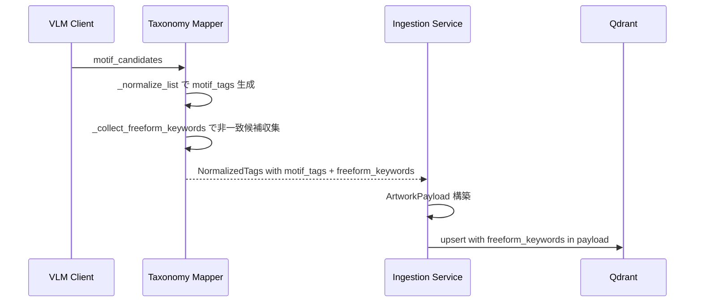

# Design Document: freeform-keywords-layer

## Overview

**Purpose**: VLM が出力するモチーフ候補の活用範囲を拡大し、ロングテールのモチーフ検索を実現する。  
**Users**: エンドユーザー（検索精度向上）、開発者（メタデータカバレッジ改善）。  
**Impact**: Taxonomy 語彙を32語→815語に拡張し、非一致候補を freeform_keywords として保持する第3層を追加。Reranker の重み配分を調整。

### Goals
- motif_vocabulary を Met Museum CC0 タグ語彙ベースで815語に拡張する
- VLM 出力の Taxonomy 非一致候補を freeform_keywords として保持・活用する
- 既存データ・テストとの後方互換性を維持する

### Non-Goals
- VLM プロンプトの変更（既存 motif_candidates 出力で十分）
- freeform_keywords による Qdrant prefilter（v1 ではベクトル検索に委任）
- mood/style/subject の freeform 収集（motif のみ対象）
- 全815語の日本語 Query Parser マッピング（頻出語のみ段階的に追加）

## Architecture

### Existing Architecture Analysis

現行システムは Offline/Online 分離アーキテクチャ。変更は以下の3層に波及する：

1. **Taxonomy 層**（`shared/taxonomy/`）: definitions.json の語彙拡張 + mapper.py の freeform 収集ロジック追加
2. **Data Model 層**（`shared/models/`）: ArtworkPayload, NormalizedTags に freeform_keywords フィールド追加
3. **Search 層**（`services/search/`）: Reranker の重み調整 + freeform boost 追加、Query Parser の日本語マッピング拡張

既存の VLM Client、Embedding Client、Firebase Storage Client、Qdrant upsert ロジックは変更不要。

### Architecture Pattern & Boundary Map

```mermaid
graph TB
    subgraph Offline
        VLM[VLM Client] --> TM[Taxonomy Mapper]
        TM --> |motif_tags| AP[ArtworkPayload]
        TM --> |freeform_keywords NEW| AP
        AP --> QR[Qdrant Repository]
    end

    subgraph Online
        QP[Query Parser] --> |filters| SR[Search Repository]
        SR --> |candidates| RR[Reranker]
        RR --> |motif_match| Score[Final Score]
        RR --> |freeform_match NEW| Score
    end

    subgraph SharedData
        DEF[definitions.json 815 terms]
        MET[met_museum_tags_filtered.json]
        MET -.-> |source| DEF
    end
```



**Architecture Integration**:
- 選択パターン: 既存レイヤードアーキテクチャの拡張（新コンポーネントなし）
- ドメイン境界: Taxonomy 層が freeform_keywords の生成責務を持つ（Ingestion 層は透過的に受け渡し）
- 既存パターン維持: VLM → Taxonomy → Payload → Qdrant のパイプライン構造
- Steering 準拠: `shared/taxonomy/` への Taxonomy 集中管理原則を維持

### Technology Stack

| Layer | Choice / Version | Role in Feature | Notes |
|-------|------------------|-----------------|-------|
| Data Model | Pydantic v2 | ArtworkPayload, NormalizedTags フィールド追加 | デフォルト値で後方互換 |
| Data / Storage | Qdrant | freeform_keywords KEYWORD index | 既存 index 構成に追加 |
| Taxonomy | definitions.json v2 | 815語 motif_vocabulary + synonym 拡張 | Met Museum CC0 ベース |

## System Flows

### Offline: freeform_keywords 収集フロー



### Online: freeform_keywords boost フロー

Reranker が候補の payload.freeform_keywords とクエリトークンを照合し、一致時にスコアを加算する。prefilter には使用しない。

## Requirements Traceability

| Requirement | Summary | Components | Interfaces | Flows |
|-------------|---------|------------|------------|-------|
| 1.1-1.6 | freeform_keywords 収集・保存 | TaxonomyMapper, NormalizedTags, ArtworkPayload, IngestionService | TaxonomyMapper.normalize, _collect_freeform_keywords | Offline 収集フロー |
| 2.1-2.3 | Qdrant payload スキーマ拡張 | QdrantRepository | ensure_collection | — |
| 3.1-3.4 | リランキングでの freeform 活用 | Reranker | _calc_freeform_match, rerank | Online boost フロー |
| 5.1-5.6 | motif_vocabulary 拡張 | definitions.json, TaxonomyMapper | — | — |
| 6.1-6.4 | Query Parser 日本語マッピング拡張 | QueryParser | _extract_motifs | — |

## Components and Interfaces

| Component | Domain/Layer | Intent | Req Coverage | Key Dependencies | Contracts |
|-----------|-------------|--------|--------------|------------------|-----------|
| definitions.json | Taxonomy | 815語モチーフ語彙 + synonym定義 | 5.1-5.6 | Met Museum tags (P2) | — |
| TaxonomyMapper | Taxonomy | freeform_keywords 収集 | 1.1-1.6 | definitions.json (P0) | Service |
| NormalizedTags | Data Model | freeform_keywords フィールド | 1.1 | — | — |
| ArtworkPayload | Data Model | freeform_keywords フィールド | 1.5 | — | — |
| IngestionService | Ingestion | freeform_keywords パススルー | 1.5 | TaxonomyMapper (P0) | — |
| QdrantRepository | Storage | freeform_keywords index | 2.1-2.3 | Qdrant (P0) | Service |
| Reranker | Search | freeform boost スコア | 3.1-3.4, 4.3 | — | Service |
| QueryParser | Search | 日本語モチーフマッピング拡張 | 6.1-6.4 | — | Service |

### Taxonomy Layer

#### definitions.json

| Field | Detail |
|-------|--------|
| Intent | Met Museum CC0語彙ベースの815語 motif_vocabulary と synonym 定義を提供 |
| Requirements | 5.1, 5.2, 5.3, 5.4, 5.5, 5.6 |

**Responsibilities & Constraints**
- motif_vocabulary: 既存32語 + Met Museum 783語 = 815語（重複排除済み）
- motif_synonyms: 既存の衝突 synonym を削除し、新規語の複数形→単数形 synonym を追加
- taxonomy_version: "v1" → "v2" に更新
- 学名→一般名の変換は vocabulary 登録時に実施（例: Bambusoideae→bamboo）

**変更する synonym**:
- 削除: cloud→sky, forest→tree, hill→mountain, building→house, person→figure, people→figure, woman→figure, man→figure, child→figure
- 維持: ocean→sea（sea が Met 語彙にも存在するため）, waves→sea, trees→tree, flowers→flower, mountains→mountain 等の複数形 synonym
- 追加: buildings→building, hills→hill, forests→forest, clouds→cloud, children→child, wolves→wolf 等

#### TaxonomyMapper

| Field | Detail |
|-------|--------|
| Intent | VLM motif_candidates の非一致候補を freeform_keywords として収集 |
| Requirements | 1.1, 1.2, 1.3, 1.4, 1.6 |

**Contracts**: Service [x]

##### Service Interface

```python
class TaxonomyMapper:
    def normalize(self, raw: VLMExtractionResult) -> NormalizedTags:
        """VLM出力を正規化。freeform_keywords を NormalizedTags に含める。"""
        ...

    def _collect_freeform_keywords(self, candidates: list[str]) -> list[str]:
        """motif_candidates のうち vocabulary/synonym に一致しなかったものを収集。
        
        フィルタ条件:
        - stopwords 除外
        - len <= 1 または len > 50 を除外
        - 小文字正規化
        - 重複排除
        
        Returns: フリーワードリスト（空リストの場合あり）
        """
        ...
```

- 前提条件: `raw.motif_candidates` が空でないリスト
- 事後条件: 返却リストの各要素は小文字、2-50文字、stopwords 非該当、vocabulary/synonym 非一致
- 不変条件: `_normalize_list` の動作に影響を与えない

**Implementation Notes**
- `_collect_freeform_keywords` は `_normalize_list` と同じフィルタロジック（stopword, synonym, vocab check）を共有するが、一致したものを除外し非一致を返す逆ロジック
- 既存の `_normalize_list` メソッドは変更不要

### Data Model Layer

#### NormalizedTags

| Field | Detail |
|-------|--------|
| Intent | freeform_keywords フィールドの追加 |
| Requirements | 1.1 |

```python
class NormalizedTags(BaseModel):
    mood_tags: list[str]
    motif_tags: list[str]
    style_tags: list[str]
    subject_tags: list[str]
    color_tags: list[str]
    freeform_keywords: list[str]  # NEW
    taxonomy_version: str = Field(min_length=1)
```

#### ArtworkPayload

| Field | Detail |
|-------|--------|
| Intent | freeform_keywords フィールドの追加 |
| Requirements | 1.5 |

```python
# subject_tags の後に追加
freeform_keywords: list[str]
```

### Ingestion Layer

#### IngestionService

| Field | Detail |
|-------|--------|
| Intent | TaxonomyMapper の freeform_keywords を ArtworkPayload に透過的に渡す |
| Requirements | 1.5 |

変更は `_run_pipeline` の ArtworkPayload 構築部分に `freeform_keywords=normalized.freeform_keywords` を1行追加するのみ。

### Storage Layer

#### QdrantRepository

| Field | Detail |
|-------|--------|
| Intent | freeform_keywords の KEYWORD index 作成 |
| Requirements | 2.1, 2.2, 2.3 |

**Contracts**: Service [x]

`ensure_collection()` の tag_field ループに `"freeform_keywords"` を追加:

```python
for tag_field in ("mood_tags", "motif_tags", "color_tags", "freeform_keywords"):
    self._client.create_payload_index(...)
```

SearchFilters と `_build_filter` は変更不要（freeform_keywords は prefilter に使用しない）。

### Search Layer

#### Reranker

| Field | Detail |
|-------|--------|
| Intent | freeform_keywords の一致をスコア合成に組み込む |
| Requirements | 3.1, 3.2, 3.3, 3.4 |

**Contracts**: Service [x]

##### Service Interface

```python
# 重み定数
_W_VECTOR: float = 0.65      # was 0.70
_W_MOTIF: float = 0.15
_W_COLOR: float = 0.10
_W_BRIGHTNESS: float = 0.05
_W_FREEFORM: float = 0.05    # NEW

class Reranker:
    def rerank(self, candidates: list[SearchResult], parsed_query: ParsedQuery) -> list[SearchResultItem]:
        """freeform_match を含むスコア合成。"""
        ...

    def _calc_freeform_match(self, candidate: SearchResult, query: ParsedQuery) -> float:
        """freeform_keywords とクエリトークンの一致度（0.0-1.0）。
        
        semantic_query を空白分割してトークン化し、
        候補の freeform_keywords との交差を計算。
        freeform_keywords が空の場合は 0.0 を返す。
        """
        ...
```

- スコア合成: `final = 0.65*vector + 0.15*motif + 0.10*color + 0.05*brightness + 0.05*freeform`
- match_reasons: freeform_match > 0 の場合「キーワード一致」を追加

#### QueryParser

| Field | Detail |
|-------|--------|
| Intent | 日本語→英語モチーフマッピングの拡張 |
| Requirements | 6.1, 6.2, 6.3, 6.4 |

**Contracts**: Service [x]

`_MOTIF_MAP` に以下の頻出語を追加（既存24語を維持した上で拡張）:

```python
# 追加候補（約30語）
"猫": "cat", "犬": "dog", "馬": "horse", "蝶": "butterfly",
"城": "castle", "塔": "tower", "寺": "temple", "教会": "church building",
"灯台": "lighthouse", "虹": "rainbow", "滝": "waterfall", "泉": "fountain",
"森": "forest", "丘": "hill", "砂漠": "desert", "島": "island", "洞窟": "cave",
"鹿": "deer", "魚": "fish", "象": "elephant", "蛇": "snake", "鷹": "eagle",
"薔薇": "rose", "蓮": "lotus", "百合": "lily", "菊": "daisy",
"剣": "sword", "冠": "crown", "鏡": "mirror", "鐘": "bell",
"雲": "cloud", "霧": "fog", "嵐": "storm", "稲妻": "lightning",
```

既存の `"森": "tree"` を `"森": "forest"` に変更（vocabulary 分離に伴う）。

## Data Models

### Domain Model

1 Artwork = 1 Qdrant point（変更なし）。payload に `freeform_keywords: list[str]` が追加される。

### Physical Data Model (Qdrant)

**payload 追加フィールド**:

| Field | Type | Index | Description |
|-------|------|-------|-------------|
| freeform_keywords | list[string] | KEYWORD | VLM motif_candidates の Taxonomy 非一致語 |

**definitions.json スキーマ変更**:

| Field | Before | After |
|-------|--------|-------|
| version | "v1" | "v2" |
| motif_vocabulary | 32語 | 815語 |
| motif_synonyms | 42エントリ（衝突含む） | 衝突削除 + 新規複数形追加 |

## Error Handling

### Error Strategy
既存のエラーハンドリングパターンを踏襲。freeform_keywords 固有の新規エラーパスなし。

- `_collect_freeform_keywords` で例外が発生した場合: 空リストを返す（graceful degradation）
- payload に freeform_keywords が存在しない場合: `payload.get("freeform_keywords", [])` でデフォルト空リスト

## Testing Strategy

### Unit Tests
- **TaxonomyMapper._collect_freeform_keywords**: 非一致候補の収集、stopword 除外、長さフィルタ、重複排除、全一致時の空リスト（6ケース）
- **TaxonomyMapper.normalize（拡張語彙）**: 815語 vocabulary での正規化動作、新 synonym の解決
- **Reranker._calc_freeform_match**: 一致ありスコア、一致なしスコア、空 freeform、match_reasons 生成（4ケース）
- **ArtworkPayload/NormalizedTags**: freeform_keywords デフォルト値、フィールド受入（2ケース）

### Integration Tests
- **Ingestion Pipeline**: VLM 出力 → Taxonomy 正規化 → freeform_keywords が payload に含まれることを確認
- **Search Pipeline**: freeform_keywords を持つ作品に対する検索で、一致時にスコアが向上することを確認
- **Taxonomy v2 Migration**: 815語 vocabulary でのインジェスション完走を確認

## Migration Strategy

1. `definitions.json` を v2 に更新（motif_vocabulary 拡張、synonym 修正）
2. Qdrant コレクションを削除・再作成（`ensure_collection` で freeform_keywords index 含む新スキーマ）
3. 全作品を再インジェスション（v2 taxonomy で正規化）
4. 検索動作確認

開発環境のため、ローリングマイグレーションは不要。コレクション再作成＋全量再インジェスションで対応。
