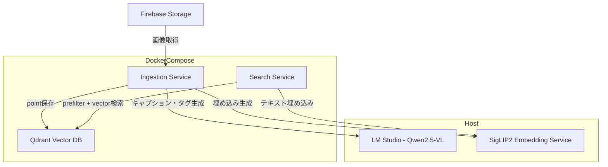
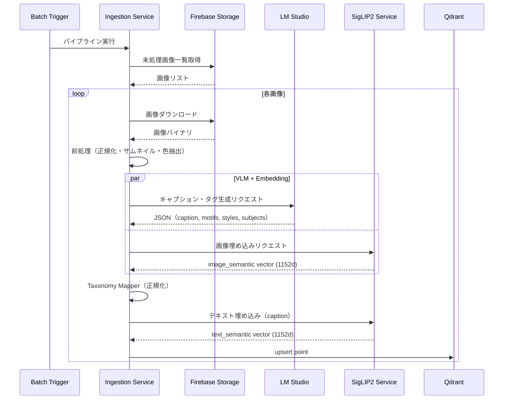
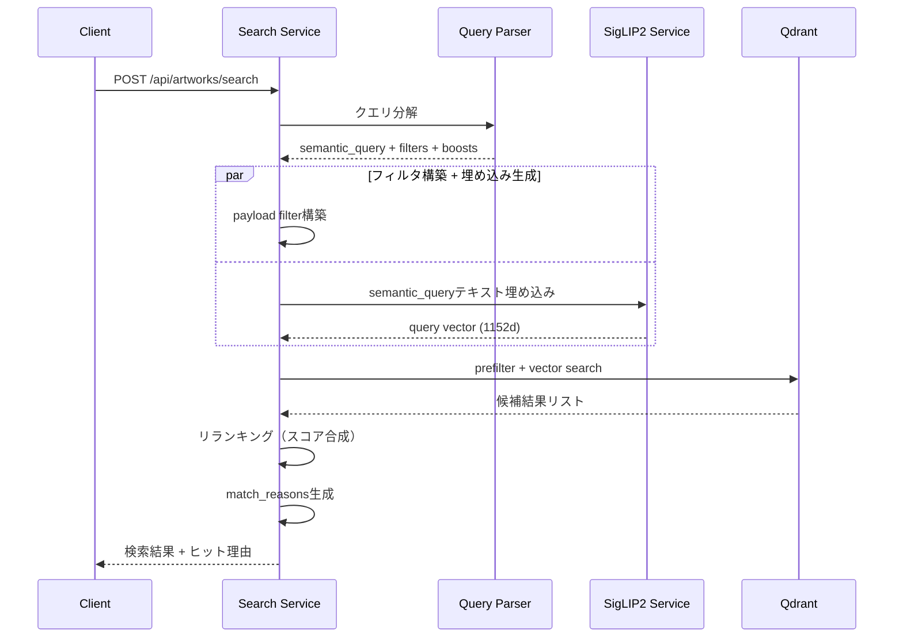
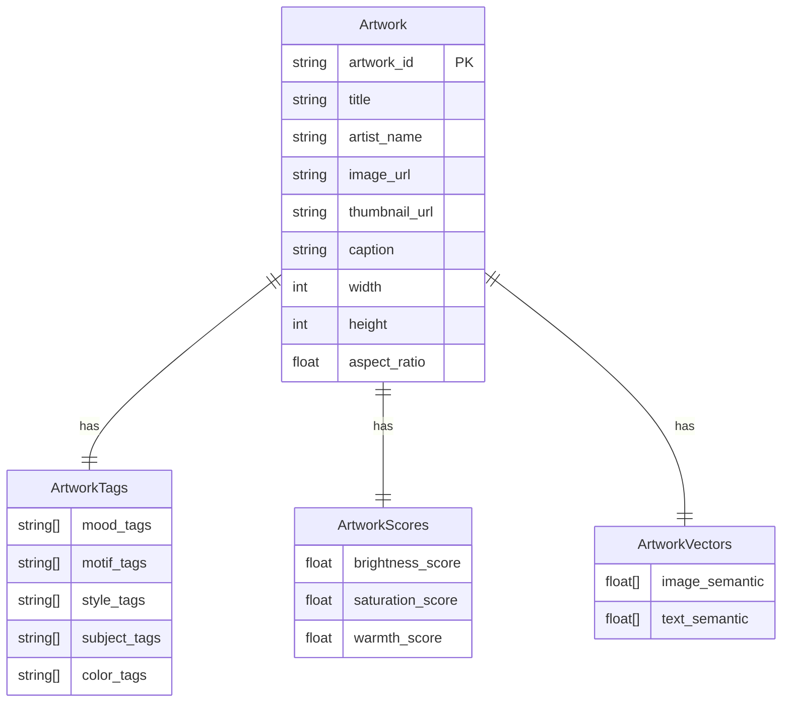

# Technical Design: image-search-local

## Overview

**Purpose**: Firebase Storage上のアートワーク画像に対し、自然言語による雰囲気・色・モチーフ検索を提供する。オフラインでの特徴抽出パイプラインとオンラインのセマンティック検索APIを分離し、Appleシリコンのローカル環境で完結するシステムを構築する。

**Users**: システム管理者（インジェスション実行・作品登録）、エンドユーザー（自然言語検索）。

**Impact**: Firebase Storageの画像資産に対し、タグ完全一致では不可能な「雰囲気」ベースの検索能力を新規に追加する。

### Goals
- オフライン特徴抽出（VLM + 埋め込み + 色抽出）パイプラインの構築
- payloadフィルタ + ベクトル類似度による複合検索APIの提供
- Docker Compose + ホスト側MLサービスのハイブリッド構成
- ヒット理由の説明付き検索結果の返却

### Non-Goals
- DINOv2やマルチモーダルrerankerの導入（v2以降）
- Qdrant multi-stage/hybrid queryの高度活用（v2以降）
- 画像アップロードによるimage-to-image検索
- ユーザー認証・認可機構
- フロントエンドUI

## Architecture

### Architecture Pattern & Boundary Map

ハイブリッド型アーキテクチャ。MLモデル推論はホスト側（LM Studio + SigLIP2埋め込みサービス）で実行し、アプリケーションロジックとデータストアはDocker Compose内で管理する。詳細な選定理由は`research.md`の「Architecture Pattern Evaluation」を参照。



**Architecture Integration**:
- Selected pattern: ハイブリッド型（ホストMLサービス + Dockerアプリケーション）
- Domain boundaries: Ingestion（オフライン処理）/ Search（オンライン処理）/ Shared（モデルクライアント・Qdrant・Taxonomy）
- New components rationale: Docker内GPU不可のため、MLサービスをホスト側に分離
- Steering compliance: サービス分離型モノレポ構成、共有モジュール経由の依存

### Technology Stack

| Layer | Choice / Version | Role in Feature | Notes |
|-------|------------------|-----------------|-------|
| Backend | FastAPI 0.135+ / Python 3.11+ | Search API, Internal API | Pydantic v2でリクエスト/レスポンス検証 |
| Vector DB | Qdrant 1.11+ (arm64) | named vectors + payload filtering | Docker公式arm64イメージ |
| VLM | Qwen2.5-VL-7B-Instruct | キャプション・タグ生成 | LM Studio経由OpenAI互換API |
| Embedding | SigLIP2 SO400M-patch14-384 | image/text 埋め込み (1152d) | ホスト側Python + Transformers + MPS |
| Storage | Firebase Storage | 画像原本 | firebase-admin SDK |
| Infrastructure | Docker Compose | Qdrant + アプリサービス | ホスト側MLサービスは別管理 |

## System Flows

### オフラインインジェスションフロー



**Key Decisions**: VLM推論と画像埋め込み生成は並列実行可能。テキスト埋め込みはキャプション確定後に実行するため逐次。

### オンライン検索フロー



## Requirements Traceability

| Requirement | Summary | Components | Interfaces | Flows |
|-------------|---------|------------|------------|-------|
| 1.1-1.6 | オフラインインジェスション | IngestionService, ImagePreprocessor, ColorExtractor, VLMClient, EmbeddingClient, TaxonomyMapper, QdrantRepository | Batch Contract, Service Interfaces | インジェスションフロー |
| 1.7 | 定期実行 | IngestionService | Batch Contract | - |
| 2.1-2.4 | Qdrantスキーマ | QdrantRepository | Collection定義 | - |
| 3.1-3.5 | 検索ロジック | SearchService, QueryParser, Reranker, EmbeddingClient, QdrantRepository | Service Interfaces | 検索フロー |
| 3.6 | 検索APIエンドポイント | SearchService | API Contract | 検索フロー |
| 4.1-4.5 | クエリ分解 | QueryParser | Service Interface | 検索フロー |
| 5.1-5.3 | 個別登録API | IngestionService | API Contract | インジェスションフロー |
| 6.1-6.4 | Docker Compose基盤 | docker-compose.yml | - | - |
| 7.1-7.4 | Taxonomy管理 | TaxonomyMapper | Service Interface | インジェスションフロー |
| 8.1-8.4 | エラーハンドリング | 全サービス | - | 両フロー |

## Components and Interfaces

| Component | Domain/Layer | Intent | Req Coverage | Key Dependencies | Contracts |
|-----------|-------------|--------|--------------|-----------------|-----------|
| IngestionService | Ingestion | インジェスションパイプライン統括 | 1.1-1.7, 5.1-5.3, 8.1, 8.3-8.4 | VLMClient(P0), EmbeddingClient(P0), QdrantRepository(P0) | Service, API, Batch |
| SearchService | Search | 検索リクエスト処理 | 3.1-3.6, 8.2 | QueryParser(P0), EmbeddingClient(P0), QdrantRepository(P0), Reranker(P1) | Service, API |
| QueryParser | Search | 自然言語クエリ分解 | 4.1-4.5 | TaxonomyMapper(P1) | Service |
| Reranker | Search | 軽量スコア合成リランキング | 3.4-3.5 | なし | Service |
| ImagePreprocessor | Ingestion | 画像正規化・サムネイル生成 | 1.1 | Pillow(P0) | Service |
| ColorExtractor | Ingestion | 支配色・brightness・saturation抽出 | 1.3 | Pillow(P0) | Service |
| TaxonomyMapper | Shared | VLM出力の語彙正規化 | 7.1-7.4 | taxonomy定義ファイル(P0) | Service |
| VLMClient | Shared | LM Studio API呼び出しラッパー | 1.2 | LM Studio(P0, External) | Service |
| EmbeddingClient | Shared | SigLIP2埋め込みサービス呼び出し | 1.5, 3.3 | SigLIP2 Service(P0, External) | Service |
| QdrantRepository | Shared | Qdrant CRUD操作 | 2.1-2.4 | qdrant-client(P0, External) | Service |

### Shared Layer

#### VLMClient

| Field | Detail |
|-------|--------|
| Intent | LM Studio（Qwen2.5-VL）へのOpenAI互換API呼び出しを抽象化 |
| Requirements | 1.2 |

**Responsibilities & Constraints**
- 画像とプロンプトを受け取り、構造化JSON（caption, motif候補, style候補, subject候補）を返す
- LM StudioのOpenAI互換chat/completions APIを使用
- レスポンスのJSON解析と基本バリデーションを実施

**Dependencies**
- External: LM Studio API (`http://host.docker.internal:<port>`) — VLM推論 (P0)

**Contracts**: Service [x]

##### Service Interface
```python
class VLMClient(Protocol):
    def extract_metadata(
        self,
        image_bytes: bytes,
        prompt: str,
    ) -> VLMExtractionResult: ...

class VLMExtractionResult(TypedDict):
    caption: str
    motif_candidates: list[str]
    style_candidates: list[str]
    subject_candidates: list[str]
    mood_candidates: list[str]
```
- Preconditions: image_bytesは有効な画像バイナリ、LM Studioが起動中
- Postconditions: 構造化されたメタデータを返す。JSON解析失敗時はVLMExtractionError
- Invariants: レスポンスは常にVLMExtractionResultの型に適合

#### EmbeddingClient

| Field | Detail |
|-------|--------|
| Intent | SigLIP2埋め込みサービスへのHTTP呼び出しを抽象化 |
| Requirements | 1.5, 3.3 |

**Responsibilities & Constraints**
- 画像またはテキストを受け取り、1152次元の埋め込みベクトルを返す
- ホスト側SigLIP2サービスのREST APIを使用

**Dependencies**
- External: SigLIP2 Embedding Service (`http://host.docker.internal:<port>`) — 埋め込み生成 (P0)

**Contracts**: Service [x]

##### Service Interface
```python
class EmbeddingClient(Protocol):
    def embed_image(self, image_bytes: bytes) -> list[float]: ...
    def embed_text(self, text: str) -> list[float]: ...
```
- Preconditions: SigLIP2サービスが起動中
- Postconditions: 1152次元のfloatリストを返す
- Invariants: 同一入力に対して同一ベクトルを返す（決定論的）

#### QdrantRepository

| Field | Detail |
|-------|--------|
| Intent | Qdrantコレクション管理・CRUD・検索操作を集約 |
| Requirements | 2.1-2.4 |

**Responsibilities & Constraints**
- artworks_v1コレクションの作成・payload index設定
- point upsert（named vectors + payload）
- prefilter + vector searchの実行
- 単一コレクション（artworks_v1）のみ操作

**Dependencies**
- External: qdrant-client Python SDK (P0)

**Contracts**: Service [x]

##### Service Interface
```python
class QdrantRepository(Protocol):
    def ensure_collection(self) -> None: ...

    def upsert_artwork(
        self,
        artwork_id: str,
        image_vector: list[float],
        text_vector: list[float],
        payload: ArtworkPayload,
    ) -> None: ...

    def search(
        self,
        query_vector: list[float],
        filters: SearchFilters | None,
        limit: int,
    ) -> list[SearchResult]: ...

    def exists(self, artwork_id: str) -> bool: ...
```

#### TaxonomyMapper

| Field | Detail |
|-------|--------|
| Intent | VLM出力の語彙揺れを正規化し、統制されたタグに変換 |
| Requirements | 7.1-7.4 |

**Responsibilities & Constraints**
- モチーフ候補を正規化済みモチーフタグに変換
- ムード候補を定義済みムード語彙セットにマッピング
- 不要・冗長タグの除去
- taxonomy_versionの付与

**Contracts**: Service [x]

##### Service Interface
```python
class TaxonomyMapper(Protocol):
    def normalize(
        self, raw: VLMExtractionResult
    ) -> NormalizedTags: ...

class NormalizedTags(TypedDict):
    mood_tags: list[str]
    motif_tags: list[str]
    style_tags: list[str]
    subject_tags: list[str]
    color_tags: list[str]
    taxonomy_version: str
```

### Ingestion Layer

#### IngestionService

| Field | Detail |
|-------|--------|
| Intent | インジェスションパイプラインの統括。Firebase取得→前処理→VLM→色抽出→Taxonomy→埋め込み→Qdrant保存 |
| Requirements | 1.1-1.7, 5.1-5.3, 8.1, 8.3-8.4 |

**Responsibilities & Constraints**
- バッチ処理: Firebase Storageから未処理画像を検出し順次処理
- 個別処理: API経由での単一作品インジェスション
- エラー時は該当作品をスキップし残りを継続
- 処理ログ（開始・終了・件数・エラー数）の記録

**Dependencies**
- Inbound: Batch Trigger / API Request — パイプライン起動 (P0)
- Outbound: VLMClient — メタデータ抽出 (P0)
- Outbound: EmbeddingClient — ベクトル生成 (P0)
- Outbound: QdrantRepository — データ保存 (P0)
- Outbound: ImagePreprocessor — 画像前処理 (P1)
- Outbound: ColorExtractor — 色情報抽出 (P1)
- Outbound: TaxonomyMapper — タグ正規化 (P0)
- External: Firebase Storage — 画像取得 (P0)

**Contracts**: Service [x] / API [x] / Batch [x]

##### API Contract
| Method | Endpoint | Request | Response | Errors |
|--------|----------|---------|----------|--------|
| POST | /internal/artworks/index | IndexRequest | IndexResponse | 400, 404, 500, 503 |

```python
class IndexRequest(BaseModel):
    artwork_id: str
    image_url: str
    title: str
    artist_name: str

class IndexResponse(BaseModel):
    artwork_id: str
    status: Literal["created", "updated"]
```

##### Batch Contract
- Trigger: cronスケジューラまたは手動実行（`python -m ingestion.run`）
- Input: Firebase Storage内の未処理画像（processed_atが存在しないもの）
- Output: Qdrant pointsへのupsert
- Idempotency: artwork_id基準のupsertにより冪等

#### ImagePreprocessor

| Field | Detail |
|-------|--------|
| Intent | 画像の正規化とサムネイル生成 |
| Requirements | 1.1 |

**Contracts**: Service [x]

##### Service Interface
```python
class ImagePreprocessor(Protocol):
    def process(self, image_bytes: bytes) -> PreprocessedImage: ...

class PreprocessedImage(TypedDict):
    normalized: bytes       # 正規化済み画像
    thumbnail: bytes        # サムネイル画像
    width: int
    height: int
    aspect_ratio: float
```

#### ColorExtractor

| Field | Detail |
|-------|--------|
| Intent | 画像から支配色・明度・彩度を抽出 |
| Requirements | 1.3 |

**Contracts**: Service [x]

##### Service Interface
```python
class ColorExtractor(Protocol):
    def extract(self, image_bytes: bytes) -> ColorInfo: ...

class ColorInfo(TypedDict):
    color_tags: list[str]       # 正規化済み色名（英語: green, gold等）
    palette_hex: list[str]      # 上位色のHEXコード
    brightness_score: float     # 0.0-1.0
    saturation_score: float     # 0.0-1.0
    warmth_score: float         # 0.0-1.0
```

### Search Layer

#### SearchService

| Field | Detail |
|-------|--------|
| Intent | 検索リクエストの受付・処理・結果返却を統括 |
| Requirements | 3.1-3.6, 8.2 |

**Responsibilities & Constraints**
- クエリ分解 → フィルタ構築 → ベクトル検索 → リランキング → match_reasons生成
- Qdrant接続失敗時はHTTP 503を返す

**Dependencies**
- Outbound: QueryParser — クエリ分解 (P0)
- Outbound: EmbeddingClient — テキスト埋め込み (P0)
- Outbound: QdrantRepository — ベクトル検索 (P0)
- Outbound: Reranker — スコア合成 (P1)

**Contracts**: Service [x] / API [x]

##### API Contract
| Method | Endpoint | Request | Response | Errors |
|--------|----------|---------|----------|--------|
| POST | /api/artworks/search | SearchRequest | SearchResponse | 400, 500, 503 |

```python
class SearchRequest(BaseModel):
    query: str
    limit: int = 24

class SearchResponse(BaseModel):
    parsed_query: ParsedQuery
    items: list[SearchResultItem]

class ParsedQuery(BaseModel):
    semantic_query: str
    filters: QueryFilters
    boosts: QueryBoosts

class QueryFilters(BaseModel):
    motif_tags: list[str] = []
    color_tags: list[str] = []

class QueryBoosts(BaseModel):
    brightness_min: float | None = None

class SearchResultItem(BaseModel):
    artwork_id: str
    title: str
    artist_name: str
    thumbnail_url: str
    score: float
    match_reasons: list[str]
```

#### QueryParser

| Field | Detail |
|-------|--------|
| Intent | 自然言語クエリをsemantic_query + filters + boostsに分解 |
| Requirements | 4.1-4.5 |

**Responsibilities & Constraints**
- ムード表現をsemantic_queryとして抽出
- 色表現を英語正規化形のcolor_tagsに変換
- モチーフ表現をmotif_tagsに変換
- 明るさ表現をbrightness boostに変換
- ルールベース + 辞書ベースの実装（v1ではLLM不使用で軽量に）

**Contracts**: Service [x]

##### Service Interface
```python
class QueryParser(Protocol):
    def parse(self, query: str) -> ParsedQuery: ...
```
- Preconditions: queryは空でない文字列
- Postconditions: ParsedQueryを返す。分解不能な場合はsemantic_query=元クエリ、空filters

#### Reranker

| Field | Detail |
|-------|--------|
| Intent | ベクトル検索結果に対し軽量スコア合成でリランキング |
| Requirements | 3.4-3.5 |

**Contracts**: Service [x]

##### Service Interface
```python
class Reranker(Protocol):
    def rerank(
        self,
        candidates: list[SearchCandidate],
        parsed_query: ParsedQuery,
    ) -> list[RankedResult]: ...
```

**Implementation Notes**
- スコア合成: `final = 0.70 * vector_sim + 0.15 * motif_match + 0.10 * color_match + 0.05 * brightness_affinity`
- match_reasonsの生成もここで実施

## Data Models

### Domain Model



- Aggregate root: Artwork（artwork_id単位で完全性を保証）
- 1 Artwork = 1 Qdrant point

### Physical Data Model (Qdrant)

**Collection**: `artworks_v1`

**Vectors定義**:
```python
vectors_config = {
    "image_semantic": VectorParams(size=1152, distance=Distance.COSINE),
    "text_semantic": VectorParams(size=1152, distance=Distance.COSINE),
}
```

**Payload schema**: `research.md`のQdrantデータスキーマ案に準拠。必須フィールド: artwork_id, title, artist_name, image_url, thumbnail_url, caption, mood_tags, motif_tags, color_tags, brightness_score, saturation_score。

**Payload indexes**:
- `mood_tags`: KeywordIndexParams
- `motif_tags`: KeywordIndexParams
- `color_tags`: KeywordIndexParams
- `brightness_score`: FloatIndexParams（range filter用）

### Data Contracts

**ArtworkPayload型定義**:
```python
class ArtworkPayload(TypedDict):
    artwork_id: str
    title: str
    artist_name: str
    image_url: str
    thumbnail_url: str
    caption: str
    mood_tags: list[str]
    motif_tags: list[str]
    style_tags: list[str]
    subject_tags: list[str]
    color_tags: list[str]
    palette_hex: list[str]
    brightness_score: float
    saturation_score: float
    warmth_score: float
    is_abstract: bool
    has_character: bool
    taxonomy_version: str
    ingested_at: str  # ISO 8601
    updated_at: str   # ISO 8601
```

## Error Handling

### Error Categories and Responses

**User Errors (4xx)**:
- 400: 不正な検索クエリ（空文字列）、不正なIndexRequestパラメータ
- 404: 指定artwork_idの画像が見つからない

**System Errors (5xx)**:
- 503: Qdrant接続失敗、SigLIP2サービス未起動、LM Studio未起動
- 500: 予期しないサーバーエラー

**Ingestion Errors**:
- VLM推論失敗 → エラーログ記録、該当作品スキップ、バッチ継続（8.1）
- SigLIP2埋め込み失敗 → エラーキュー記録、次回バッチで再試行（8.4）
- Firebase画像取得失敗 → エラーログ記録、スキップ

### Monitoring
- バッチ処理: 開始/終了/処理件数/エラー件数のログ出力（8.3）
- 構造化ログ: JSON形式でstdoutに出力
- ホストサービスヘルスチェック: 起動時にLM Studio・SigLIP2サービスの疎通確認

## Testing Strategy

### Unit Tests
- QueryParser: 各種日本語クエリの分解結果を検証
- TaxonomyMapper: VLM出力の正規化ルール検証
- ColorExtractor: 色抽出・スコア算出の精度検証
- Reranker: スコア合成ロジックとmatch_reasons生成の検証

### Integration Tests
- IngestionService: モックVLM/EmbeddingClient経由でパイプライン全体の動作確認
- SearchService: モックQdrant経由で検索フロー全体の動作確認
- QdrantRepository: テスト用Qdrantコンテナでのupsert/search動作確認

### E2E Tests
- インジェスション→検索の一気通貫テスト（テスト画像セット使用）
- 検索精度評価: 評価セットに対するrecall@k測定

## Performance & Scalability

- **インジェスション速度**: VLM推論がボトルネック。1画像あたり数秒〜十数秒を想定。バッチ処理のため許容
- **検索レイテンシ**: SigLIP2テキスト埋め込み（~100ms） + Qdrant検索（~50ms） + リランキング（~10ms）。目標: 500ms以内
- **スケーリング**: v1は単一Qdrantインスタンス。数万点規模まで対応可能。それ以上はQdrantクラスタ化を検討（v2）
