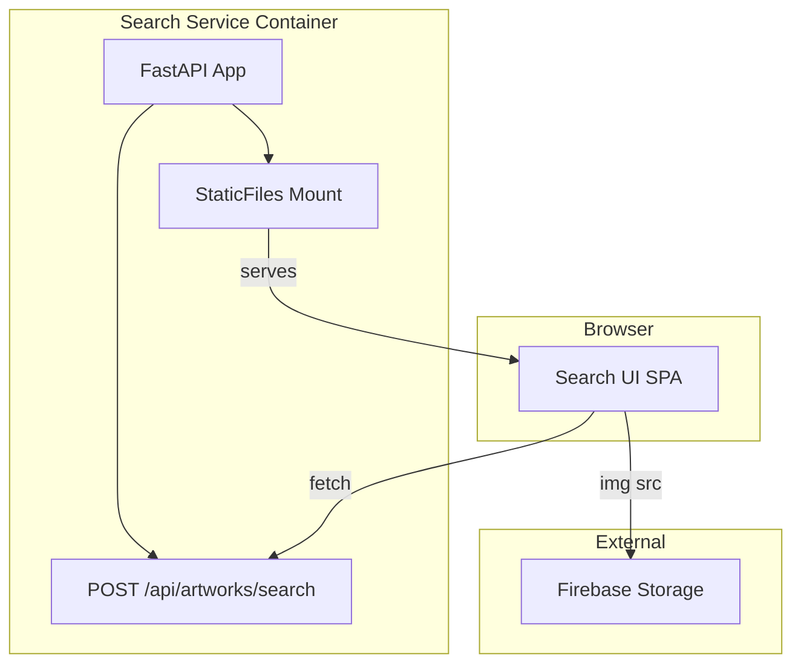
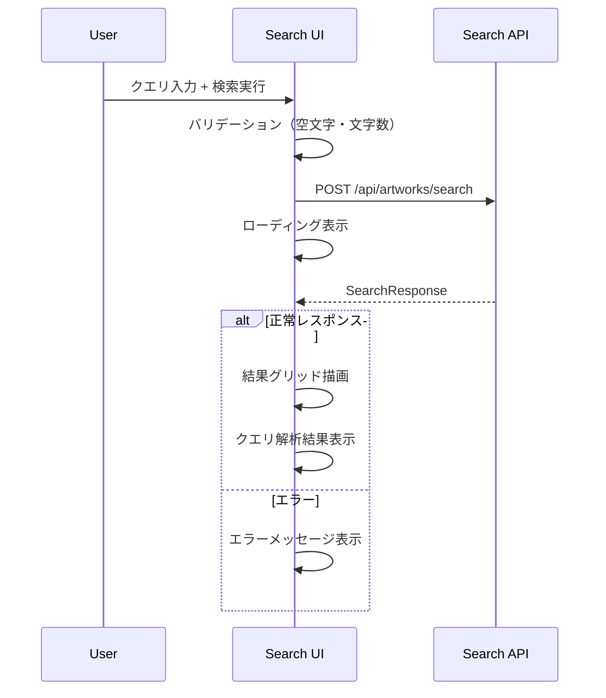

# Design Document: search-ui-spa

## Overview
**Purpose**: 既存のSearch API（`POST /api/artworks/search`）に対するブラウザベースの検索UIを提供し、ユーザーが自然言語クエリでアートワークを視覚的に探索できるようにする。

**Users**: アートワークコレクションの閲覧者が、デスクトップおよびモバイルブラウザから検索・結果閲覧のワークフローで利用する。

**Impact**: Searchサービスに静的ファイル配信機能を追加し、フロントエンドUIレイヤーを新設する。

### Goals
- 自然言語入力からAPIリクエスト送信、結果のグリッド表示までをシームレスに提供する
- クエリ解析結果とヒット理由を可視化し、検索の透明性を確保する
- ビルドインフラ不要の軽量SPAとして既存Dockerベース環境に統合する

### Non-Goals
- ユーザー認証・アクセス制御（対象外）
- 検索結果のページネーション（v1ではlimit指定のみ）
- 作品詳細ページ・画像ビューアー（単一画面検索に限定）
- バックエンドAPI自体の変更（既存APIをそのまま消費）

## Architecture

### Existing Architecture Analysis
- Search APIはFastAPIベースで`POST /api/artworks/search`を提供（ポート8000）
- 静的ファイル配信（StaticFiles）は未設定
- Dockerfileでは`services/search/`配下のみコピー
- APIエンドポイントは`/api/`および`/internal/`プレフィックスを使用、ルート`/`は未使用

### Architecture Pattern & Boundary Map



**Architecture Integration**:
- **Selected pattern**: 同一コンテナ内StaticFiles配信。APIと静的ファイルを同一FastAPIアプリから提供
- **Domain/feature boundaries**: フロントエンド（`/static/`ディレクトリ）とバックエンドAPI（`/api/`プレフィックス）の明確な分離
- **Existing patterns preserved**: FastAPIアプリのlifespan構造、APIルーティング規約
- **New components rationale**: 静的ファイルディレクトリとStaticFilesマウントの追加のみ。新サービスは不要
- **Steering compliance**: サービス独立性を維持しつつ、最小限の変更で統合

### Technology Stack

| Layer | Choice / Version | Role in Feature | Notes |
|-------|------------------|-----------------|-------|
| Frontend | Vanilla JS (ES2020+) | SPA実装（検索UI、結果表示） | ビルドツール不要、ブラウザネイティブ |
| Styling | CSS3 (Grid + Custom Properties) | レスポンシブレイアウト、テーマ定義 | 外部CSSライブラリ不要 |
| Backend | FastAPI StaticFiles | 静的ファイル配信 | 既存FastAPIアプリへのマウント追加 |
| Infrastructure | 既存Docker Compose | 変更なし（Dockerfileのみ更新） | 追加コンテナ不要 |

## System Flows

### 検索実行フロー



## Requirements Traceability

| Requirement | Summary | Components | Interfaces | Flows |
|-------------|---------|------------|------------|-------|
| 1.1 | テキスト入力・検索ボタン表示 | SearchForm | — | — |
| 1.2 | 検索ボタンでAPI呼び出し | SearchForm, ApiClient | ApiClient.search() | 検索実行フロー |
| 1.3 | Enterキーで検索実行 | SearchForm | — | 検索実行フロー |
| 1.4 | 空クエリ時ボタン無効化 | SearchForm | — | — |
| 1.5 | 500文字上限制御 | SearchForm | — | — |
| 2.1 | グリッドレイアウト表示 | ResultGrid | — | 検索実行フロー |
| 2.2 | タイトル・アーティスト名・サムネイル表示 | ResultCard | — | — |
| 2.3 | 0件メッセージ | ResultGrid | — | — |
| 2.4 | 件数表示 | ResultGrid | — | — |
| 3.1 | match_reasonsタグ表示 | ResultCard | — | — |
| 3.2 | ホバー/タップでスコア詳細表示 | ResultCard | — | — |
| 4.1 | ローディングインジケーター | SearchForm, ResultGrid | — | 検索実行フロー |
| 4.2 | 処理中ボタン無効化 | SearchForm | — | — |
| 4.3 | エラーメッセージ表示 | ResultGrid | ApiClient.search() | 検索実行フロー |
| 4.4 | タイムアウトメッセージ | ResultGrid | ApiClient.search() | 検索実行フロー |
| 5.1 | parsed_query内容表示 | QueryInfo | — | 検索実行フロー |
| 5.2 | フィルタタグの視覚的区別 | QueryInfo | — | — |
| 6.1 | デスクトップグリッド自動調整 | ResultGrid | — | — |
| 6.2 | モバイル1〜2列切り替え | ResultGrid | — | — |
| 6.3 | アスペクト比維持 | ResultCard | — | — |
| 7.1 | 静的ファイル構成 | 全コンポーネント | — | — |
| 7.2 | StaticFiles配信統合 | StaticFilesMount | — | — |
| 7.3 | 同一画面SPA | App（エントリポイント） | — | — |

## Components and Interfaces

| Component | Domain/Layer | Intent | Req Coverage | Key Dependencies | Contracts |
|-----------|--------------|--------|--------------|------------------|-----------|
| App | UI / Entry | SPAエントリポイント、コンポーネント初期化 | 7.3 | SearchForm, ResultGrid, QueryInfo | State |
| SearchForm | UI / Input | 検索入力とフォーム制御 | 1.1-1.5, 4.1-4.2 | App (P0) | State |
| ApiClient | UI / Service | Search APIへのHTTPリクエスト | 1.2, 4.3-4.4 | — | Service |
| ResultGrid | UI / Display | 検索結果のグリッドレイアウト | 2.1, 2.3-2.4, 4.1, 6.1-6.2 | ApiClient (P0) | State |
| ResultCard | UI / Display | 個別結果アイテムの表示 | 2.2, 3.1-3.2, 6.3 | ResultGrid (P0) | — |
| QueryInfo | UI / Display | クエリ解析結果の可視化 | 5.1-5.2 | App (P0) | — |
| StaticFilesMount | Backend / Config | FastAPIへの静的ファイルマウント | 7.1-7.2 | FastAPI app (P0) | API |

### UI / Service Layer

#### ApiClient

| Field | Detail |
|-------|--------|
| Intent | Search APIへのfetchリクエスト送信、レスポンス・エラーのハンドリング |
| Requirements | 1.2, 4.3, 4.4 |

**Responsibilities & Constraints**
- `POST /api/artworks/search`へのリクエスト送信とレスポンスパース
- タイムアウト検知（30秒）とエラーハンドリング
- HTTPステータスに基づくエラー分類

**Dependencies**
- External: Search API `POST /api/artworks/search` — 検索リクエスト送信 (P0)

**Contracts**: Service [x]

##### Service Interface
```python
# JSDoc / TypeScript-like定義（実装はVanilla JS）

# SearchRequest
# {
#   query: str       # 1-500文字
#   limit: int       # 1-100, default=24
# }

# SearchResponse
# {
#   parsed_query: {
#     semantic_query: str,
#     filters: { motif_tags: list[str], color_tags: list[str] },
#     boosts: { brightness_min: float | null }
#   },
#   items: list[{
#     artwork_id: str,
#     title: str,
#     artist_name: str,
#     thumbnail_url: str,
#     score: float,
#     match_reasons: list[str]
#   }]
# }

class ApiClient:
    async search(query: str, limit: int = 24) -> SearchResponse:
        """Search APIを呼び出し、SearchResponseを返す。"""
        # エラー時はApiErrorを送出
        ...
```
- Preconditions: `query`は1文字以上500文字以下
- Postconditions: `SearchResponse`オブジェクトまたは`ApiError`
- Invariants: タイムアウトは30秒固定

**Implementation Notes**
- `fetch` APIを使用、`AbortController`でタイムアウト制御
- HTTPステータス4xx/5xxはエラーメッセージとしてUIに伝播
- ネットワークエラーとタイムアウトは個別メッセージで区別

### UI / Entry Layer

#### App

| Field | Detail |
|-------|--------|
| Intent | SPAのエントリポイント。コンポーネント初期化とイベント連携 |
| Requirements | 7.3 |

**Contracts**: State [x]

##### State Management
- **State model**: `{ query: str, loading: bool, response: SearchResponse | null, error: str | null }`
- **Persistence & consistency**: メモリ内のみ（永続化なし）
- **Concurrency strategy**: 検索リクエストは最新1件のみ有効（前回リクエストはAbortController.abort()）

**Implementation Notes**
- DOMContentLoadedでコンポーネント初期化
- SearchForm.onSearch → ApiClient.search → ResultGrid.render + QueryInfo.render のイベントチェーン
- 状態はAppモジュール内のオブジェクトリテラルで管理

### UI / Input Layer

#### SearchForm

| Field | Detail |
|-------|--------|
| Intent | テキスト入力フィールド・検索ボタンのUI制御 |
| Requirements | 1.1, 1.2, 1.3, 1.4, 1.5, 4.1, 4.2 |

**Implementation Notes**
- `<form>` + `<input type="text">` + `<button type="submit">`構成
- `input`イベントで空文字チェック→ボタンdisabled制御
- `submit`イベント（Enter/クリック共通）でonSearchコールバック発火
- `maxlength="500"` + JSバリデーションで文字数制御
- loading状態でボタンdisabled + テキスト変更（「検索中...」）

### UI / Display Layer

#### ResultGrid

| Field | Detail |
|-------|--------|
| Intent | 検索結果のレスポンシブグリッドレイアウト管理 |
| Requirements | 2.1, 2.3, 2.4, 4.1, 6.1, 6.2 |

**Implementation Notes**
- CSS Grid（`auto-fill`, `minmax(280px, 1fr)`）でレスポンシブ列数自動調整
- 結果0件時は専用メッセージ表示、エラー時はエラーメッセージ表示
- ローディング中はスピナー表示
- 件数表示は結果ヘッダーに`「N件の作品が見つかりました」`

#### ResultCard

| Field | Detail |
|-------|--------|
| Intent | 個別検索結果アイテムの表示（サムネイル、メタデータ、ヒット理由） |
| Requirements | 2.2, 3.1, 3.2, 6.3 |

**Implementation Notes**
- サムネイル画像は`object-fit: cover`でアスペクト比維持
- `match_reasons`は小さなバッジ/タグとしてカード下部に表示
- ホバー（デスクトップ）/ タップ（モバイル）でオーバーレイ表示：スコア値とmatch_reasons一覧
- 画像読み込みエラー時はプレースホルダー表示

#### QueryInfo

| Field | Detail |
|-------|--------|
| Intent | クエリ解析結果（semantic_query、フィルタタグ）の可視化 |
| Requirements | 5.1, 5.2 |

**Implementation Notes**
- 検索結果ヘッダー下に表示
- `semantic_query`はテキスト表示
- `motif_tags`は緑系バッジ、`color_tags`は青系バッジで視覚的区別
- フィルタが空の場合は非表示

### Backend / Config Layer

#### StaticFilesMount

| Field | Detail |
|-------|--------|
| Intent | FastAPIアプリへの静的ファイルマウント設定 |
| Requirements | 7.1, 7.2 |

**Contracts**: API [x]

##### API Contract
| Method | Endpoint | Request | Response | Errors |
|--------|----------|---------|----------|--------|
| GET | / | — | index.html | 404 |
| GET | /static/* | — | CSS/JS/assets | 404 |

**Implementation Notes**
- `app.mount("/", StaticFiles(directory="static", html=True))` をAPIルート定義の**後に**追加（ルート優先順位）
- Dockerfileに`COPY services/search/static/ ./services/search/static/`を追加
- 静的ファイルディレクトリ: `services/search/static/`

## Data Models

本featureは新規データモデルを導入しない。既存の`SearchRequest`/`SearchResponse`をそのまま消費する。フロントエンド内の状態はメモリ内オブジェクトとして管理し、永続化しない。

## Error Handling

### Error Strategy
フロントエンドでのエラーハンドリングに限定。バックエンドAPIのエラー処理は既存実装を維持。

### Error Categories and Responses
| カテゴリ | 原因 | UI表示 |
|---------|------|--------|
| バリデーションエラー | 空クエリ、500文字超過 | ボタン無効化、入力制限 |
| APIエラー (4xx) | 不正なリクエスト | 「検索条件を確認してください」 |
| サーバーエラー (5xx) | API内部エラー | 「サーバーエラーが発生しました。しばらくしてから再試行してください」 |
| タイムアウト | 30秒超過 | 「接続がタイムアウトしました」 |
| ネットワークエラー | 接続不可 | 「ネットワーク接続を確認してください」 |
| 画像読み込みエラー | サムネイルURL無効 | プレースホルダー画像表示 |

## Testing Strategy

### Unit Tests
- ApiClient: fetch mock を用いたリクエスト送信・レスポンスパース・エラーハンドリング
- SearchForm: inputイベント・submitイベント・バリデーションロジック
- ResultCard: match_reasons表示、画像エラー時のフォールバック

### Integration Tests
- 検索フロー全体: 入力→API呼び出し→結果表示の一連動作（fetch mock使用）
- エラーフロー: API各種エラーステータスに対するUI表示確認
- 空結果フロー: 0件レスポンスに対するメッセージ表示

### E2E/UI Tests
- デスクトップ検索フロー: 入力→検索→結果グリッド表示→ヒット理由確認
- モバイルレスポンシブ: 768px未満でのグリッド列数切り替え確認
- エラー表示: タイムアウト・サーバーエラー時のメッセージ表示

## File Structure

```
services/search/static/
├── index.html          # SPAエントリポイント
├── css/
│   └── style.css       # レイアウト・テーマ定義
└── js/
    ├── app.js          # Appエントリポイント・状態管理
    ├── api-client.js   # ApiClient（fetch wrapper）
    ├── search-form.js  # SearchFormコンポーネント
    ├── result-grid.js  # ResultGridコンポーネント
    ├── result-card.js  # ResultCardコンポーネント
    └── query-info.js   # QueryInfoコンポーネント
```
