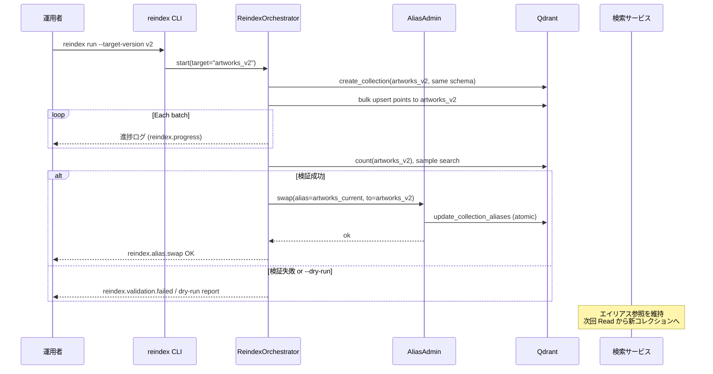
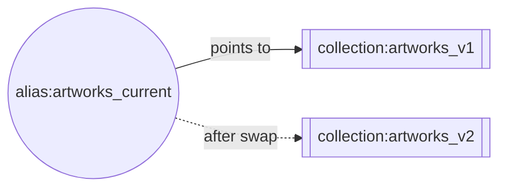

# Design Document

## Overview

**Purpose**: 検索サービスを停止させずに Qdrant コレクションの全件再インデックスを実行できる Blue/Green 運用を導入する。Qdrant のエイリアス機能を使い、検索経路は物理コレクション名ではなくエイリアスを参照する構造に組み替える。

**Users**: 本機能の直接の利用者は運用者（CLI 実行者）。エンドユーザーはエイリアス切替を意識せず検索を継続できる。

**Impact**: 現在 `artworks_v1` 固定参照で組まれている QdrantRepository と FastAPI lifespan を、エイリアス解決を通した間接参照へ変更する。インジェスションには再インデックス専用の CLI/ランナーが追加される。再インデックス運用中・切替時ともに、検索サービスはプロセス再起動なしで動作する。初回カットオーバー（既存 `artworks_v1` → エイリアス運用）は停止許容とする（Introduction 参照）。

### Goals
- 再インデックス運用中・エイリアス切替時に検索サービスを止めない
- 切替をアトミックに行い、検証に失敗した場合は絶対に切り替わらない
- 運用イベントを Cloud Logging 互換の JSON 構造化ログで出力し、将来 Terraform/GCP 化時に再設計不要

### Non-Goals
- 既存 `artworks_v1` 運用からの自動移行・後方互換（初回移行は停止許容）
- Qdrant 以外のベクトル DB への抽象化
- Terraform モジュール・GCP リソース定義の実装（ランタイム契約のみ整える）
- 検索サービスの水平スケール・リクエスト負荷分散

## Architecture

### Existing Architecture Analysis

- `shared/config.py:Settings` が `qdrant_collection="artworks_v1"` を固定で保持
- `shared/qdrant/repository.py:QdrantRepository` が `self._collection = settings.qdrant_collection` を初期化時に固定
- `services/search/app.py` の lifespan で `QdrantRepository` を 1 回だけ生成し、全リクエストで使い回す
- `services/ingestion/batch.py` と `pipeline.py` が同じ `QdrantRepository` を使って書き込み
- 共有モジュールは `/shared/` に集約する慣例 (`structure.md`)

**保持する境界**:
- `QdrantRepository` は「コレクションへの CRUD を集約する」層としてそのまま活かす
- Settings の env 経由注入パターンを維持
- サービス間共有は `/shared/` 経由の原則を守る

### Architecture Pattern & Boundary Map

```mermaid
graph LR
    subgraph Search Service (FastAPI)
        APP[app.py lifespan]
        REPO_S[QdrantRepository\n読み取り専用]
        HEALTH[/healthz /readyz/]
    end

    subgraph Ingestion Service
        DIFF[差分ingestion\nrun.py / batch.py]
        REINDEX[reindex CLI\nservices/ingestion/reindex.py]
    end

    subgraph shared/qdrant
        RESOLVER[CollectionResolver]
        REPO[QdrantRepository]
        ADMIN[AliasAdmin]
    end

    subgraph Qdrant
        ALIAS((alias:\nartworks_current))
        COL_V1[[artworks_v1]]
        COL_V2[[artworks_v2]]
    end

    APP --> REPO_S
    REPO_S --> RESOLVER
    DIFF --> REPO
    REINDEX --> REPO
    REINDEX --> ADMIN
    REPO --> RESOLVER
    RESOLVER -.resolves.-> ALIAS
    ADMIN -.create/swap/drop.-> ALIAS
    ALIAS --> COL_V1
    ADMIN -.create/populate.-> COL_V2
    ALIAS -. after swap .-> COL_V2
```

**Architecture Integration**:
- **Pattern**: Blue/Green コレクション + Qdrant エイリアスによる間接参照（Read path はエイリアス、Write path はエイリアスまたは明示物理名）
- **Boundary**: 「コレクション解決」を `CollectionResolver` という新しい責務として `/shared/qdrant/` に切り出し、`QdrantRepository` は解決結果を使う側に徹する。エイリアス管理（create/swap/drop）は `AliasAdmin` として書き込みだけに閉じる
- **新規コンポーネントの根拠**:
  - `CollectionResolver`: Read 時点で最新のエイリアス先を決める単一ポイント。検索サービスのプロセス再起動を不要にする
  - `AliasAdmin`: エイリアス操作を原子的に行い、切替・ロールバックの API を提供
  - `ReindexOrchestrator` + CLI: 新物理コレクション作成 → バルク投入 → 検証 → 切替 の一連フローをスクリプト化
  - `StructuredLogger`: Cloud Logging 互換 JSON の単一入口（移植性担保）
- **Steering compliance**: `structure.md` の「共有は /shared/ 経由」「設定外部化」に準拠、`tech.md` の Qdrant/Python パターンを崩さない

### Technology Stack

| Layer | Choice / Version | Role in Feature | Notes |
|-------|------------------|-----------------|-------|
| Backend / Services | Python 3.11+, FastAPI | 既存の検索 / インジェスション基盤 | 変更なし |
| Data / Storage | Qdrant (qdrant-client) | コレクション＋エイリアス | `update_collection_aliases` を使う |
| CLI | Python argparse / Typer（既存方針踏襲） | 再インデックス・切替・ロールバック | `services/ingestion/reindex.py` を新設 |
| Observability | 標準 `logging` + 自前 JSON Formatter | Cloud Logging 互換出力 | 追加ライブラリ導入しない |
| Config | pydantic-settings（既存） | env 経由の設定注入 | 新フィールド追加のみ |

## System Flows

### 再インデックスから切替までのシーケンス



**フロー上の決定事項**:
- 切替は「新コレクション完走 + 検証合格」後にのみ実行（Req 3, 4）
- 旧コレクションは残したまま：ロールバックは同じ `AliasAdmin.swap` で戻るだけ（Req 5）
- 検索サービス側は「リクエストごとに `CollectionResolver.resolve()` を呼ぶ」シンプルな方針を採用し、プロセス再起動なしで切替を拾える（Req 1）

## Requirements Traceability

| Requirement | Summary | Components | Interfaces | Flows |
|-------------|---------|------------|------------|-------|
| 1.1-1.4 | エイリアス経由参照 | CollectionResolver, QdrantRepository | `resolve()`, read APIs | Startup / Read |
| 2.1-2.4 | Blue/Green 構築 | ReindexOrchestrator, QdrantRepository | `create_collection()` | Reindex flow |
| 3.1-3.4 | 原子的切替 | AliasAdmin | `swap()`, `--dry-run` | Swap step |
| 4.1-4.4 | 切替前検証 | ValidationGate | `validate()` | Pre-swap |
| 5.1-5.4 | ロールバック／保持 | AliasAdmin, CLI | `rollback`, `drop-collection` | Post-swap |
| 6.1-6.4 | 差分取込との両立 | QdrantRepository (write), CLI | alias-aware upsert | During reindex |
| 7.1-7.6 | 可視性／Cloud Logging | StructuredLogger, HealthEndpoint | `/readyz`, JSON log | Cross-cutting |
| 8.1-8.6 | GCP 前提 | Settings, HealthEndpoint, Logger | env-only config | Cross-cutting |
| 9.1-9.6 | 運用ドキュメント | `docs/runbooks/reindex.md`, `CLAUDE.md`/`README.md` リンク | Markdown contract | Documentation |

## Components and Interfaces

### Shared / Qdrant 層

#### CollectionResolver

| Field | Detail |
|-------|--------|
| Intent | エイリアス名 → 物理コレクション名の解決を一箇所に集約する |
| Requirements | 1.1, 1.2, 1.3, 1.4 |

**Responsibilities & Constraints**
- 検索サービスは Read 時にエイリアス名を渡し、Resolver が Qdrant から現在の対応先を返す
- 内部キャッシュは持たない（切替を即時反映するため）。Qdrant への呼び出しは軽量 (`get_collection_aliases`) なので許容
- エイリアスが存在しない場合は例外を送出し、呼び出し側でヘルス NG・起動失敗として扱う

**Dependencies**
- Outbound: `QdrantClient.get_collection_aliases` (P0)

##### Service Interface
```python
class CollectionResolver:
    def __init__(self, client: QdrantClient, alias_name: str) -> None: ...
    def resolve(self) -> str:
        """エイリアスの現在のターゲット物理コレクション名を返す。未定義なら AliasNotFoundError を送出。"""
    def exists(self) -> bool:
        """起動時プローブ用。エイリアス定義の有無を真偽で返す。"""
```
- Preconditions: `alias_name` は空文字でない
- Postconditions: 戻り値は Qdrant 上に実在するコレクション名（`resolve()` 成功時）
- Invariants: 副作用なし

#### QdrantRepository（改修）

| Field | Detail |
|-------|--------|
| Intent | CRUD/検索の入口。コレクション名を `CollectionResolver` から取得する構造に変更 |
| Requirements | 1.1, 1.3, 2.4, 6.1, 6.2 |

**Responsibilities & Constraints**
- **読み取り (`search`, `exists`)**: 毎回 `resolver.resolve()` を呼び、返った物理名で Qdrant に問い合わせる
- **書き込み (`upsert_artwork`)**: 呼び出し側が「alias 経由で write する（差分ingestion）」か「明示物理名に write する（再インデックス）」かを指定できるよう、`target_collection: str | None = None` を受け付ける。`None` なら Resolver を使う
- **`ensure_collection`**: 物理名を明示的に引数で受け取り、**指定された物理コレクション**を作成する（旧動作の暗黙的 `self._collection` 参照は廃止）

##### Service Interface (変更後の主要シグネチャ)
```python
class QdrantRepository:
    def __init__(
        self,
        client: QdrantClient,
        resolver: CollectionResolver,
        vector_dim: int,
    ) -> None: ...

    def ensure_collection(self, physical_name: str) -> None: ...
    def upsert_artwork(
        self,
        artwork_id: str,
        image_vector: list[float],
        text_vector: list[float],
        payload: ArtworkPayload,
        target_collection: str | None = None,
    ) -> None: ...
    def search(self, query_vector: list[float], filters: SearchFilters | None, limit: int) -> list[SearchResult]: ...
    def exists(self, artwork_id: str) -> bool: ...
    def count(self, physical_name: str | None = None) -> int: ...  # 新設（検証用）
```
- Preconditions: `resolver` は初期化済み
- Invariants: 読み取り系は必ず `resolver.resolve()` 経由、書き込み系は `target_collection or resolver.resolve()`

**Implementation Notes**
- Settings → QdrantRepository の初期化は `shared/qdrant/factory.py`（新設）で `CollectionResolver` 生成を含めて一箇所にまとめる
- 既存 `_collection` フィールドは削除し、直接参照箇所（テストを含む）を引数渡しに書き換える

#### AliasAdmin

| Field | Detail |
|-------|--------|
| Intent | エイリアスの作成・切替・削除を原子的に行う |
| Requirements | 3.1, 3.2, 3.3, 3.4, 5.1, 5.2, 5.3, 5.4 |

**Responsibilities & Constraints**
- 切替は `qdrant_client.update_collection_aliases(change_aliases_operations=[DeleteAlias, CreateAlias])` を **単一呼び出し** で発行（Qdrant は 1 リクエスト内のオペレーションを原子的に処理）
- ターゲットの物理コレクションが存在しない場合は切替前に `CollectionNotFoundError` を送出
- `drop_physical_collection(name)` は「現在エイリアスが指しているコレクションは削除不可」をガード

##### Service Interface
```python
class AliasAdmin:
    def current_target(self, alias: str) -> str | None: ...
    def swap(self, alias: str, new_target: str) -> SwapResult: ...
    def rollback(self, alias: str, previous_target: str) -> SwapResult: ...
    def drop_physical_collection(self, name: str, alias: str) -> None: ...

@dataclass
class SwapResult:
    alias: str
    previous_target: str | None
    new_target: str
    swapped_at: datetime
```
- Preconditions: `new_target`/`previous_target` が Qdrant に実在
- Postconditions: 成功時はエイリアスが `new_target` を指す。失敗時は状態不変
- Invariants: 現行ターゲットは `drop_physical_collection` できない

### Ingestion / Reindex 層

#### ReindexOrchestrator

| Field | Detail |
|-------|--------|
| Intent | 新コレクション作成 → バルク投入 → 検証 → エイリアス切替 を一気通貫で実行 |
| Requirements | 2.1, 2.2, 2.3, 2.4, 4.1, 4.2, 4.3, 4.4 |

**Responsibilities & Constraints**
- 入力: 既存インジェスション `IngestionPipeline` と同じソース（Firebase Storage）を走らせ、`QdrantRepository.upsert_artwork(target_collection=physical_new)` で新コレクションへ書き込む
- 途中失敗した場合は**新コレクションを残したまま終了**し、同一 `target-version` を指定した再実行で冪等に継続（`exists` と `upsert` の組合せで重複なく完了）
- 検証は `ValidationGate` へ委譲し、失敗時は切替を行わず非ゼロ終了

**Contracts**: Batch [x] / Service [x]

##### Batch / Job Contract
- Trigger: `python -m services.ingestion.reindex run --target-version v2 [--source-version v1] [--sample-ratio 0.9] [--dry-run] [--skip-validation]`
- Input / validation: `target-version` は `^[a-zA-Z0-9_-]+$`。未指定時は CLI エラー
- Output / destination: Qdrant 新物理コレクション、構造化ログ（`reindex.started`, `reindex.progress`, `reindex.validation.*`, `reindex.alias.swap`）
- Idempotency & recovery: 既存ポイントは `point_id = sha256(artwork_id)` によって決まる → 再実行で重複しない

#### ValidationGate

| Field | Detail |
|-------|--------|
| Intent | エイリアス切替前に新コレクションが十分に育ったかを検証 |
| Requirements | 4.1, 4.2, 4.3, 4.4 |

**Responsibilities & Constraints**
- ポイント件数比: `count(new) / count(old) >= sample_ratio_threshold` （デフォルト 0.9）
- サンプル検索: `config/reindex_samples.json`（新規、後述）に記載の固定クエリで `query_points` を実行し、例外なく結果が返ること（件数 0 は許容、例外はNG）
- `--skip-validation` 指定時は `event=reindex.validation.skipped` の WARN 以上ログを残して通過

##### Service Interface
```python
class ValidationGate:
    def validate(self, old: str | None, new: str, sample_queries: list[list[float]]) -> ValidationReport: ...

@dataclass
class ValidationReport:
    passed: bool
    checks: list[CheckResult]  # name, passed, detail
```

### Search Service 層

#### HealthEndpoint（改修）

| Field | Detail |
|-------|--------|
| Intent | Cloud Run/GKE のプローブに直接マップできる粒度で `/healthz`（liveness）と `/readyz`（readiness）を提供 |
| Requirements | 7.1, 8.5 |

**Responsibilities & Constraints**
- `/healthz`: プロセスが生きていれば 200（依存なし）
- `/readyz`: `CollectionResolver.resolve()` が成功 + 該当コレクションへの `count` が成功したときのみ 200。レスポンスに `{"alias": ..., "collection": ..., "points_count": N}` を含める
- 既存 `/health` は残し、内部は `/readyz` と同じ実装に委譲（破壊的変更回避）

##### API Contract
| Method | Endpoint | Request | Response | Errors |
|--------|----------|---------|----------|--------|
| GET | /healthz | – | `{"status": "ok"}` | – |
| GET | /readyz | – | `{"alias": "...", "collection": "...", "points_count": int}` | 503 |
| GET | /health | – | 同 /readyz | 503 |

### Cross-cutting

#### StructuredLogger

| Field | Detail |
|-------|--------|
| Intent | Cloud Logging が自動解釈する JSON 1 行ログを全サービス共通で出力 |
| Requirements | 7.3, 7.4, 7.5, 7.6, 8.2 |

**Responsibilities & Constraints**
- 標準 `logging.Logger` のフォーマッタとして実装（追加依存なし）
- 出力フィールド: `severity`, `message`, `time` (ISO8601 UTC), `logging.googleapis.com/labels`（`service`, `env`, `event` など）、`logging.googleapis.com/trace`, `logging.googleapis.com/spanId`
- 未処理例外: `sys.excepthook` と FastAPI の例外ハンドラから `@type=type.googleapis.com/google.devtools.clouderrorreporting.v1beta1.ReportedErrorEvent` を付与して出力
- `LOG_FORMAT=text` の場合は人間可読フォーマッタへフォールバック
- API キー等のシークレットは LogRecord の `extra` 経由でも出力されないよう、Formatter 側で既知のキー (`qdrant_api_key` 等) を `"***"` に置換

**イベントキー一覧**（Terraform からログベースメトリクス定義時に参照）:

| event | 出力箇所 | severity | 意味 |
|-------|----------|----------|------|
| `reindex.started` | ReindexOrchestrator | INFO | 再インデックス開始 |
| `reindex.progress` | ReindexOrchestrator | INFO | 進捗（一定件数ごと） |
| `reindex.collection.created` | ReindexOrchestrator | INFO | 新コレクション作成完了 |
| `reindex.collection.recreated` | ReindexOrchestrator | INFO | `--force-recreate` で既存コレクションを削除・再作成 |
| `reindex.dry_run` | ReindexOrchestrator | INFO | `--dry-run` で切替を省略 |
| `reindex.aborted` | ReindexOrchestrator | ERROR | 検証失敗により切替中止 |
| `reindex.validation.passed` | ValidationGate | NOTICE | 検証合格 |
| `reindex.validation.failed` | ValidationGate | ERROR | 検証失敗（切替中止） |
| `reindex.validation.skipped` | ValidationGate | WARNING | `--skip-validation` 実行 |
| `reindex.alias.swap` | AliasAdmin | NOTICE | 切替成功 |
| `reindex.alias.swap.failed` | AliasAdmin | ERROR | 切替失敗 |
| `reindex.rollback` | AliasAdmin | NOTICE | ロールバック成功 |
| `reindex.collection.dropped` | AliasAdmin | NOTICE | 旧コレクション削除 |
| `ingestion.alias.mismatch` | QdrantRepository / run.py | WARNING | 差分 ingestion の投入先がエイリアス対象と不一致 |
| `search.alias.unresolved` | CollectionResolver | CRITICAL | エイリアス未定義で readiness NG |
| `search.readiness.failed` | search.app | ERROR | `/readyz` が resolver/count 失敗で 503 |

#### Settings（改修）

| Field | Detail |
|-------|--------|
| Intent | alias 名・検証設定・ログ設定を env から注入 |
| Requirements | 1.4, 4.1, 7.6, 8.1, 8.2 |

追加／変更フィールド:

| Name | Type | Default | 意味 |
|------|------|---------|------|
| `qdrant_alias` | str | `"artworks_current"` | 検索が参照するエイリアス名 |
| `qdrant_api_key` | str \| None | None | Secret Manager 注入想定、ログ不出力 |
| `reindex_validation_ratio` | float | 0.9 | ValidationGate の閾値 |
| `reindex_sample_queries_path` | str | `"config/reindex_samples.json"` | サンプルクエリ定義ファイル |
| `log_format` | Literal["json","text"] | `"json"` | StructuredLogger 出力モード |
| `log_level` | str | `"INFO"` | ルートロガーレベル |
| `service_name` | str | `"image-search"` | ログ labels 用 |
| `env_name` | str | `"local"` | ログ labels 用 (`local`/`staging`/`prod` 等) |

既存 `qdrant_collection` は **初回セットアップ用のデフォルト物理名**として残す（`ensure_collection` / 初回 CLI から参照）が、検索 Read 経路からは参照しない。

### Documentation 層

#### Operational Runbook (`docs/runbooks/reindex.md`)

| Field | Detail |
|-------|--------|
| Intent | 再インデックス・切替・ロールバック・旧コレクション削除の全運用フローを、人間と LLM の両方が辿れる形で 1 ファイルに集約する |
| Requirements | 9.1, 9.2, 9.3, 9.4, 9.5, 9.6 |

**Responsibilities & Constraints**
- 単一ソース・オブ・トゥルース: design.md は「何が作られるか」、Runbook は「どう動かすか」を担う
- LLM 可読性を担保するため、次の構造的制約を満たす:
  - H2 見出しは運用シナリオ単位（`## 1. 新規再インデックスの実行` 等）で、番号付きの固定順序
  - 各シナリオは H3 で `前提条件 / コマンド / 期待ログ / 成功判定 / 失敗時アクション` を同順序で必ず含む
  - コマンドは ```` ```bash ```` コードブロックで、環境変数はコメント行に列挙
  - イベントキーは ```` ```text ```` 内に 1 行 1 キーで列挙（文中で散らさない）

**固定シナリオ一覧**（実装時にはこの見出し体系を踏襲する）:

| # | H2 見出し | 対応 CLI | 主なイベントキー |
|---|-----------|----------|------------------|
| 1 | 新規再インデックスの実行 | `reindex run --target-version vN` | `reindex.started` → `reindex.progress` → `reindex.validation.passed` → `reindex.alias.swap` |
| 2 | ドライランで切替計画を確認 | `reindex run ... --dry-run` | `reindex.validation.*`（切替なし） |
| 3 | ロールバック | `reindex rollback --to vN-1` | `reindex.rollback` |
| 4 | 旧コレクションの安全な削除 | `reindex drop-collection artworks_vN-1` | `reindex.collection.dropped` |
| 5 | 検索サービスの健全性確認 | `curl .../readyz` | `search.alias.unresolved`（異常時） |
| 6 | 障害時の判断フロー | - | 全 `*.failed` 系 |

**Discoverability 要件 (Req 9.4)**:
- `CLAUDE.md` に `## Operational Runbooks` セクションを追加し、`docs/runbooks/reindex.md` への相対リンクを 1 行で掲載
- `README.md` の「運用」セクションからも同ファイルへリンク
- LLM が `CLAUDE.md` を自動読み込みするため、起動時点で Runbook 存在が認識される

**Contracts**: Documentation (Markdown)

##### チェックリストひな形（Req 9.5）
Runbook 各シナリオの末尾に、以下の形式でチェックリストを含める:

```markdown
### 成功判定チェックリスト
- [ ] `event=reindex.alias.swap` ログが出力された
- [ ] `curl http://localhost:8000/readyz` が 200、`collection` フィールドが新物理名
- [ ] 任意の検索 API リクエストが 200 で結果を返す
```

**Implementation Notes**
- 変更同期 (Req 9.6): design.md / CLI 引数の変更 PR には必ず Runbook 差分を含めるよう、PR テンプレートにチェック項目を追加（`.github/pull_request_template.md` がなければ新設）

## Data Models

### 永続データ: Qdrant コレクションとエイリアス



- **物理コレクション命名規則**: `artworks_<version>`、`version` は `^[a-zA-Z0-9_-]+$`（Req 2.1）
- **スキーマ**: named vectors `image_semantic` / `text_semantic`（COSINE, dim=1152）、payload index は `mood_tags`/`motif_tags`/`color_tags`/`freeform_keywords` (keyword) + `brightness_score` (float) — 新コレクションも同一スキーマで作成（Req 2.4）
- **エイリアス**: 検索 Read はエイリアス名参照、書き込みは「エイリアス or 明示物理名」（Req 1, 6）

### 設定データ: `config/reindex_samples.json` (新規)

```json
{
  "version": 1,
  "queries": [
    {"label": "mood_calm", "text": "やさしい雰囲気の風景"},
    {"label": "color_green_gold", "text": "緑と金が入っている作品"}
  ]
}
```
- テキストは既存の embedding サービスで事前にベクトル化してから `ValidationGate` へ渡す
- サンプルクエリ不在または不正 JSON の場合は ValidationGate が INFO ログ出力の上、スキップではなく**検証失敗**として扱う（静かに通さない）

### ログレコード構造（Cloud Logging 互換）

```json
{
  "severity": "NOTICE",
  "time": "2026-04-14T16:21:03.123Z",
  "message": "alias swapped",
  "logging.googleapis.com/labels": {
    "service": "ingestion",
    "env": "local",
    "event": "reindex.alias.swap"
  },
  "logging.googleapis.com/trace": "projects/.../traces/abc",
  "logging.googleapis.com/spanId": "abc123",
  "alias": "artworks_current",
  "previous_target": "artworks_v1",
  "new_target": "artworks_v2"
}
```

## Error Handling

### Error Strategy

| Category | 具体例 | 応答 |
|----------|--------|------|
| 設定不正 | `QDRANT_ALIAS` が空 | 起動時例外で即終了、severity=CRITICAL, `event=config.invalid` |
| エイリアス未定義 | `CollectionResolver.resolve` 失敗 | 検索サービスは `/readyz` を 503、`event=search.alias.unresolved` |
| 物理コレクション不在 | `AliasAdmin.swap` 前提崩れ | 切替中止、非ゼロ終了、`event=reindex.alias.swap.failed` |
| 検証失敗 | `ValidationGate` で件数不足 | 切替中止、`event=reindex.validation.failed`、構造化詳細付き |
| Qdrant 一時エラー | タイムアウト | CLI 側は指数バックオフ再試行（最大 3 回）、検索 API 側は 502 に変換 |
| 予期せぬ例外 | 未補足 | Cloud Error Reporting 互換形式で 1 レコード出力、FastAPI は 500 |

### Monitoring

- `event` ラベル (表参照) を Terraform 側で log-based metric / alert に展開
- `/readyz` が連続 503 → Uptime Check / Cloud Monitoring からアラート（将来）
- `reindex.progress` の投入件数停滞（例: 5 分間同値）→ 将来ダッシュボード化

## Testing Strategy

### Unit Tests
- `CollectionResolver.resolve` がエイリアスの現在ターゲットを返す（`get_collection_aliases` をモック）
- `CollectionResolver.resolve` が未定義エイリアスで `AliasNotFoundError` を送出
- `AliasAdmin.swap` が `DeleteAlias` + `CreateAlias` を単一 `update_collection_aliases` で発行
- `ValidationGate.validate` が件数比 < 閾値で `passed=False` を返す
- `StructuredLogger` が `severity`/`labels`/`event` を含む 1 行 JSON を出力し、既知シークレットキーを `***` に置換

### Integration Tests（Qdrant コンテナ使用、既存 `tests/test_qdrant_repository.py` と同様）
- Blue/Green 切替: コレクション A 作成 → エイリアス A → 検索 → コレクション B 作成 → swap → 検索結果が B の内容に切替わる
- 再インデックス中の差分 upsert が旧コレクションに入り、検証段階で新コレクションに不足分として観測できる
- `AliasAdmin.drop_physical_collection` が現行ターゲット指定時に失敗する

### E2E / UI Tests
- 検索 API 経由で「alias 切替の直前直後で 500 が発生しない」ことを `pytest` で連続リクエスト検証
- `/readyz` がエイリアス削除シナリオで 503、再作成で 200 に戻る

### Performance / Load
- 100k points 規模の新コレクション構築時に `reindex.progress` が 30 秒以内間隔で出力される
- swap 直後 1 分間の検索レイテンシ増加が通常時の +10% 以内（`CollectionResolver` のオーバーヘッド確認）

## Security Considerations

- Qdrant API キー等のシークレットは `Settings.qdrant_api_key` のみで受け取り、`repr`/ログ/`/readyz` のいずれにも出力しない（Formatter 側でキー名ベースに `***` 置換）
- CLI ツール (`reindex run`/`rollback`/`drop-collection`) はローカル実行前提のため認可レイヤは設けないが、将来 GCP 移行時は Cloud Run Job の IAM で実行権限を絞る設計とする（ランタイム契約は Req 8 で担保）

## Performance & Scalability

- 検索 Read 1 回あたりで `CollectionResolver.resolve()` による `get_collection_aliases` が 1 回追加。Qdrant は同一プロセス内 gRPC/HTTP で数 ms 台のため、P95 への影響は無視できると見込む。万一影響が出たら TTL 数秒のミニキャッシュを入れる余地を `CollectionResolver` 内に残す（今回は実装しない）
- 切替は Qdrant 側で原子的（メタデータのみ更新）のため、切替中の検索はいずれかの物理コレクションへルーティングされ、結果が混ざることはない

## Migration Strategy

```mermaid
flowchart LR
    A[現状: artworks_v1 直参照] --> B[検索サービス停止]
    B --> C[alias 作成\nartworks_current -> artworks_v1]
    C --> D[新コード deploy\n(Resolver/Admin/Logger 組み込み)]
    D --> E[検索サービス再開]
    E --> F[以降は無停止で\nreindex run / rollback]
```

- 初回カットオーバーのみ停止を許容（Introduction 参照）
- Rollback トリガ: `/readyz` が 5 分連続 503、または検索エラー率が平常比 3 倍
- Validation checkpoints: `/readyz` 200、検索 API に対する smoke クエリ 1 本が 200 を返す

## Supporting References

- Qdrant Aliases 公式ドキュメント — `update_collection_aliases` のアトミック性の根拠
- Cloud Logging structured logging 特殊フィールド — `severity`, `logging.googleapis.com/trace` 等の採用根拠（Req 7.3）
- 既存コード参照: `shared/qdrant/repository.py`, `services/search/app.py`, `services/ingestion/batch.py`
